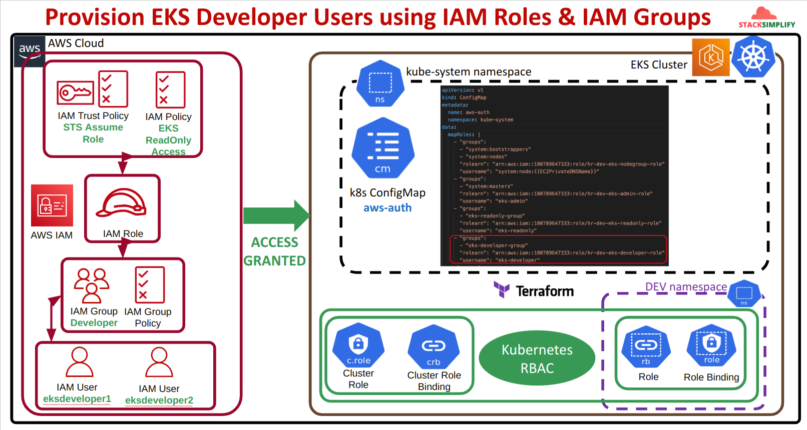
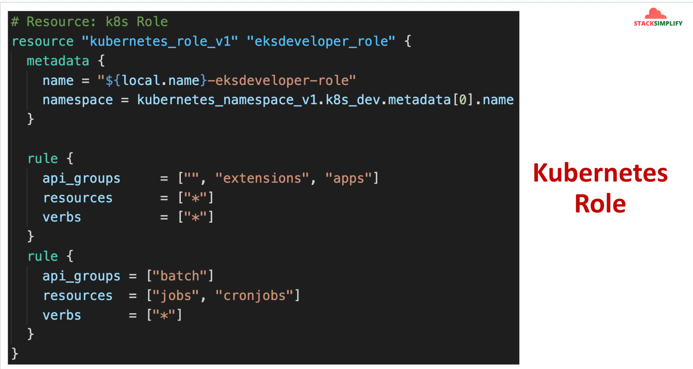
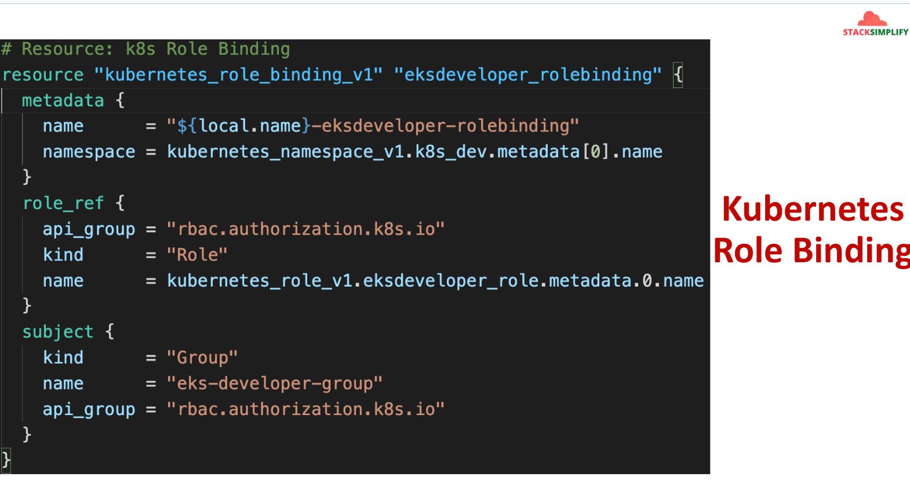

## I. Structure `EKS Develop`

### 1. EKS Develop User using IAM role & IAM group


### 2. RoleBinding and aws-auth ConfigMap




## II. Hand-on `EKS Develop` as `IAM roles` and `IAM group`

### Step-01: Provision `EKS cluster`
```powershell
terraform init

terraform validate

terraform plan

terraform apply
```
### Step-02: check `IAM groups`
```powershell

# List up IAM groups
aws iam list-groups

# Result
{
    "Groups": [
        {
            "Path": "/",
            "GroupName": "admin",
            "GroupId": "AGPATQHCR4OMZD4NA2RGK",
            "Arn": "arn:aws:iam::<account-id>:group/admin",
            "CreateDate": "2022-12-12T15:07:39+00:00"
        },
        {
            "Path": "/",
            "GroupName": "developer",
            "GroupId": "AGPATQHCR4OMZGQECSIQH",
            "Arn": "arn:aws:iam::<account-id>:group/developer",
            "CreateDate": "2023-01-03T15:37:22+00:00"
        },
        {
            "Path": "/",
            "GroupName": "eks-users-eks-admins",
            "GroupId": "AGPATQHCR4OM27DYWG2VG",
            "Arn": "arn:aws:iam::<account-id>:group/eks-users-eks-admins",
            "CreateDate": "2024-09-01T09:29:45+00:00"
        },
        {
            "Path": "/",
            "GroupName": "eks-users-eks-develop",
            "GroupId": "AGPATQHCR4OMQ7KFI7FW4",
            "Arn": "arn:aws:iam::<account-id>:group/eks-users-eks-develop",
            "CreateDate": "2024-09-01T09:42:34+00:00"
        },
        {
            "Path": "/",
            "GroupName": "eks-users-eks-readonly",
            "GroupId": "AGPATQHCR4OMRF5P3BSGQ",
            "Arn": "arn:aws:iam::<account-id>:group/eks-users-eks-readonly",
            "CreateDate": "2024-09-01T09:29:45+00:00"
        }
    ]
}

# List up users in group (GEt IAM group)
aws iam get-group --group-name eks-users-eks-readonly

# results:
{
    "Users": [
        {
            "Path": "/",
            "UserName": "eks-users-eks-develop-user",
            "UserId": "AIDATQHCR4OMWNQSJJJBR",
            "Arn": "arn:aws:iam::<account-id>:user/eks-users-eks-develop-user",
            "CreateDate": "2024-09-01T09:45:50+00:00"
        }
    ],
    "Group": {
        "Path": "/",
        "GroupName": "eks-users-eks-develop",
        "GroupId": "AGPATQHCR4OMQ7KFI7FW4",
        "Arn": "arn:aws:iam::<account-id>:group/eks-users-eks-develop",
        "CreateDate": "2024-09-01T09:42:34+00:00"
    }
}
```

### Step-03: Create profile for user `eks-users-eks-develop-user` which belong to `eks-users-eks-readonly` (on Step 02)
```powershell
aws iam create-access-key --user-name eks-users-eks-develop-user

# access key response
{
    "AccessKey": {
        "UserName": "eks-users-eks-develop-user",
        "AccessKeyId": "12345678",
        "Status": "Active",
        "SecretAccessKey": "12345678",
        "CreateDate": "2024-08-29T18:06:08+00:00"
    }
}

# config aws-cli profile
aws configure --profile eks-users-eks-develop-user

# AWS Access Key ID [None]: 12345678
# AWS Secret Access Key [None]: 12345678
# Default region name [None]: ap-southeast-1
# Default output format [None]

# testing sts
aws sts get-caller-identity --profile eks-users-eks-develop-user

# result
{
    "UserId": "AIDATQHCR4OMZR5UTUBJ5",
    "Account": "<account-id>",
    "Arn": "arn:aws:iam::<account-id>:user/eks-users-eks-develop-user"
}
```

### Step-04: Get temporary Token, Access_Key, Secret_Key from `arn:aws:iam::<account-id>:role/study-dev-eks-cluster-eks-develop-user-role` by using `aws sts` and `assume-role`
```powershell

# get temporary Token, Access_Key, Secret_Key
aws sts assume-role --profile eks-users-eks-develop-user --role-arn "arn:aws:iam::<account-id>:role/study-dev-eks-cluster-eks-develop-user-role" --role-session-name "EKS_DEVELOP_USER"

# Result:
{
    "Credentials": {
        "AccessKeyId": "RoleAccessKeyID",
        "SecretAccessKey": "RoleSecretKey",
        "SessionToken": "RoleSessionToken",
        "Expiration": "2024-08-31T10:36:29+00:00"
    },
    "AssumedRoleUser": {
        "AssumedRoleId": "AROATQHCR4OM6MCX3PLVO:EKS_DEVELOP_USER",
        "Arn": "arn:aws:sts::<account-id>:assumed-role/study-dev-eks-cluster-eks-develop-user-role/EKS_DEVELOP_USER"
    }
}

# testing
export AWS_ACCESS_KEY_ID=RoleAccessKeyID
export AWS_SECRET_ACCESS_KEY=RoleSecretKey
export AWS_SESSION_TOKEN=RoleSessionToken

# check which user aws-cli using
aws sts get-caller-identity

# Result
{
    "UserId": "AROATQHCR4OM6MCX3PLVO:EKS_DEVELOP_USER",
    "Account": "<account-id>",
    "Arn": "arn:aws:sts::<account-id>:assumed-role/study-dev-eks-cluster-eks-develop-user-role/EKS_DEVELOP_USER"
}
```

### step-05: update `kube-config` file
```powershell
# command
aws eks --region <region-code> update-kubeconfig --name <cluster_name> --profile <AWS-CLI-PROFILE-NAME>

# example
aws eks --region ap-southeast-1 update-kubeconfig --name study-dev-eks-cluster
```

### step-06: check `aws-auth` and kubernetes resources (Must using `EKS admin`)
```powershell
# check `aws-auth`
k get configmap aws-auth -n kube-system -o yaml

# result:
apiVersion: v1
data:
  mapRoles: |
    - "groups":
      - "system:bootstrappers"
      - "system:nodes"
      "rolearn": "arn:aws:iam::<account-id>:role/study-dev-eks-cluster-eks-node-group-role"
      "username": "system:node:{{EC2PrivateDNSName}}"
    - "groups":
      - "system:masters"
      "rolearn": "arn:aws:iam::<account-id>:role/study-dev-eks-cluster-eks-admin-user-role"
      "username": "iam-role-as-eks-admin"
    - "groups":
      - "readonly-group"
      "rolearn": "arn:aws:iam::<account-id>:role/study-dev-eks-cluster-eks-readonly-user-role"
      "username": "iam-role-as-eks-readonly"
    - "groups":
      - "develop-group"
      "rolearn": "arn:aws:iam::<account-id>:role/study-dev-eks-cluster-eks-develop-user-role"
      "username": "iam-role-as-eks-develop"
  mapUsers: |
    - "groups":
      - "system:masters"
      "userarn": "arn:aws:iam::<account-id>:user/eks-users-basic-user"
      "username": "eks-users-basic-user"
    - "groups":
      - "system:masters"
      "userarn": "arn:aws:iam::<account-id>:user/eks-users-admin-user"
      "username": "eks-users-admin-user"
    - "groups":
      - "readonly-group"
      "userarn": "arn:aws:iam::<account-id>:user/eks-users-iam-read-only-user"
      "username": "iam-user-as-eks-readonly"
immutable: false
kind: ConfigMap
metadata:
  creationTimestamp: "2024-09-01T09:31:45Z"
  name: aws-auth
  namespace: kube-system
  resourceVersion: "1004"
  uid: 7366a1b9-e468-49ec-a4c2-f0a86233294a
```

### step-07: check `role`, `role-binding` and kubernetes resources on `develop namespace` (Must using `EKS admin`)
```powershell
# command:
k get roles,rolebinding -n develop

# result
NAME                                              CREATED AT
role.rbac.authorization.k8s.io/eks-develop-role   2024-09-01T09:29:46Z

NAME                                                                                   ROLE                    AGE   USERS   GROUPS          SERVICEACCOUNTS
rolebinding.rbac.authorization.k8s.io/study-dev-eks-cluster-eks-develop-role-binding   Role/eks-develop-role   23m           develop-group
```


### Step-08: checking create Kubernetes resource on `develop namespace` (Using `EKS develop user`)

#### Step-08-00: change `namespace` on `kube-config`
```powershell
# command:
k config set-context --current --namespace develop
```

#### Step-08-01: check create pod
```powershell
# Testing create pod:
k run nginx-developer-pod --image=nginx -n develop

# Result:
pod/nginx-developer-pod created

# List pods
k get pods -n develop

# Result:
NAME               READY   STATUS    RESTARTS   AGE
nginx-developer-pod   1/1     Running   0          37s
```

#### Step-08-02: Try deploy service, deployment onto `develop namespace` (Using `EKS develop user` )
```powershell
# command:
k apply -f ~/Projects/terraform-eks/terraform-kubernetes/project-1-webserver/kubernetes

# Result
deployment.apps/webserver created
service/webserver-lb-service created
service/webserver-nlb-service created
service/webserver-node-port-service created
```
#### Step-08-03: Check deploy service, deployment onto `develop namespace` (Using `EKS develop user` )
```powershell
# check pods on develop namespace
k get pods -n develop

# result
NAME                         READY   STATUS    RESTARTS   AGE
nginx-developer-pod          1/1     Running   0          6m7s
webserver-6d96c44cb8-lnh5g   1/1     Running   0          56s
webserver-6d96c44cb8-nddh5   1/1     Running   0          56s

# check deployment on develop namespace
k get deployment -n develop

# result
NAME        READY   UP-TO-DATE   AVAILABLE   AGE
webserver   2/2     2            2           94s

# check services on develop namespace
 k get services -n develop
NAME                          TYPE           CLUSTER-IP       EXTERNAL-IP                                                                    PORT(S)        AGE
webserver-lb-service          LoadBalancer   172.20.160.7     a96e0e6421e5649fca212454e67519f9-626014490.ap-southeast-1.elb.amazonaws.com    80:31221/TCP   103s
webserver-nlb-service         LoadBalancer   172.20.58.26     af72bd55313654d178c044b843abd739-1733941043.ap-southeast-1.elb.amazonaws.com   80:32474/TCP   103s
webserver-node-port-service   NodePort       172.20.191.101   <none>  
```

#### Step-08-04: Delete service, deployment ... onto `develop namespace` (Using `EKS develop user` )
```powershell
# command:
k delete -f ~/Projects/terraform-eks/terraform-kubernetes/project-1-webserver/kubernetes

# Result
deployment.apps "webserver" deleted
service "webserver-lb-service" deleted
service "webserver-nlb-service" deleted
service "webserver-node-port-service" deleted
```