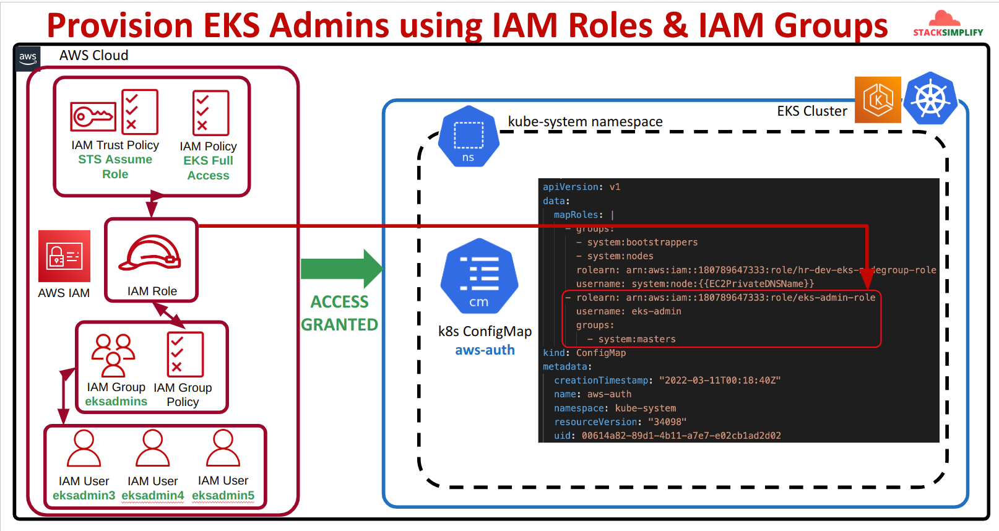

## II. Hand-on `EKS admin` as `IAM roles` and `IAM group`

### Step-01: Structure
#### 1. EKS admin


#### 2. EKS Readonly


### Step-02: check `IAM groups`
```powershell

# List up IAM groups
aws iam list-groups

# Result
{
    "Groups": [
        {
            "Path": "/",
            "GroupName": "admin",
            "GroupId": "AGPATQHCR4OMZD4NA2RGK",
            "Arn": "arn:aws:iam::<account-id>:group/admin",
            "CreateDate": "2022-12-12T15:07:39+00:00"
        },
        {
            "Path": "/",
            "GroupName": "developer",
            "GroupId": "AGPATQHCR4OMZGQECSIQH",
            "Arn": "arn:aws:iam::<account-id>:group/developer",
            "CreateDate": "2023-01-03T15:37:22+00:00"
        },
        {
            "Path": "/",
            "GroupName": "eks-users-eks-admins",
            "GroupId": "AGPATQHCR4OM3ANGKXVU6",
            "Arn": "arn:aws:iam::<account-id>:group/eks-users-eks-admins",
            "CreateDate": "2024-08-31T08:31:49+00:00"
        }
    ]
}

# List up users in group (GEt IAM group)
aws iam get-group --group-name eks-users-eks-admins

# results:
{
    "Users": [
        {
            "Path": "/",
            "UserName": "eks-users-eks-admin3",
            "UserId": "AIDATQHCR4OMZR5UTUBJ5",
            "Arn": "arn:aws:iam::<account-id>:user/eks-users-eks-admin3",
            "CreateDate": "2024-08-31T08:31:50+00:00"
        }
    ],
    "Group": {
        "Path": "/",
        "GroupName": "eks-users-eks-admins",
        "GroupId": "AGPATQHCR4OM3ANGKXVU6",
        "Arn": "arn:aws:iam::<account-id>:group/eks-users-eks-admins",
        "CreateDate": "2024-08-31T08:31:49+00:00"
    }
}
```

### Step-03: Create profile for user `eks-users-eks-admin3` which belong to `eks-users-eks-admins` (on Step 02)
```powershell
aws iam create-access-key --user-name eks-users-eks-admin3

# access key response
{
    "AccessKey": {
        "UserName": "sts-user",
        "AccessKeyId": "12345678",
        "Status": "Active",
        "SecretAccessKey": "12345678",
        "CreateDate": "2024-08-29T18:06:08+00:00"
    }
}

# config aws-cli profile
aws configure --profile eks-users-eks-admin3

# AWS Access Key ID [None]: 12345678
# AWS Secret Access Key [None]: 12345678
# Default region name [None]: ap-southeast-1
# Default output format [None]

# testing sts
aws sts get-caller-identity --profile eks-users-eks-admin3

# result
{
    "UserId": "AIDATQHCR4OMZR5UTUBJ5",
    "Account": "<account-id>",
    "Arn": "arn:aws:iam::<account-id>:user/eks-users-eks-admin3"
}
```

### Step-04: Get temporary Token, Access_Key, Secret_Key from `arn:aws:iam::<account-id>:role/study-dev-eks-cluster-eks-admin-user-role` by using `aws sts` and `assume-role`
```powershell

# get temporary Token, Access_Key, Secret_Key
aws sts assume-role --profile eks-users-eks-admin3 --role-arn "arn:aws:iam::<account-id>:role/study-dev-eks-cluster-eks-admin-user-role" --role-session-name "EKS_ADMIN_USER"

# Result:
{
    "Credentials": {
        "AccessKeyId": "RoleAccessKeyID",
        "SecretAccessKey": "RoleSecretKey",
        "SessionToken": "RoleSessionToken",
        "Expiration": "2024-08-31T10:36:29+00:00"
    },
    "AssumedRoleUser": {
        "AssumedRoleId": "AROATQHCR4OM6MCX3PLVO:EKS_ADMIN_USER",
        "Arn": "arn:aws:sts::<account-id>:assumed-role/study-dev-eks-cluster-eks-admin-user-role/EKS_ADMIN_USER"
    }
}

# testing
export AWS_ACCESS_KEY_ID=RoleAccessKeyID
export AWS_SECRET_ACCESS_KEY=RoleSecretKey
export AWS_SESSION_TOKEN=RoleSessionToken

# check
aws sts get-caller-identity

# Result
{
    "UserId": "AROATQHCR4OM6MCX3PLVO:EKS_ADMIN_USER",
    "Account": "<account-id>",
    "Arn": "arn:aws:sts::<account-id>:assumed-role/study-dev-eks-cluster-eks-admin-user-role/EKS_ADMIN_USER"
}
```

### step-05: check `aws-auth` and kubernetes resources
```powershell
# check `aws-auth`
k get configmap aws-auth -n kube-system -o yaml

# result:
apiVersion: v1
data:
  mapRoles: |
    - "groups":
      - "system:bootstrappers"
      - "system:nodes"
      "rolearn": "arn:aws:iam::<account-id>:role/study-dev-eks-cluster-eks-node-group-role"
      "username": "system:node:{{EC2PrivateDNSName}}"
    - "groups":
      - "system:masters"
      "rolearn": "arn:aws:iam::<account-id>:role/study-dev-eks-cluster-eks-admin-user-role"
      "username": "iam-role-as-eks-admin"
  mapUsers: |
    - "groups":
      - "system:masters"
      "userarn": "arn:aws:iam::<account-id>:user/eks-users-eks-admin-2"
      "username": "eks-users-eks-admin-2"
    - "groups":
      - "system:masters"
      "userarn": "arn:aws:iam::<account-id>:user/eks-users-eks-admin"
      "username": "eks-users-eks-admin"
immutable: false
kind: ConfigMap
metadata:
  creationTimestamp: "2024-08-31T08:51:01Z"
  name: aws-auth
  namespace: kube-system
  resourceVersion: "3556"
  uid: 9f53fa7b-a90f-4f34-98c7-3eb49f24b66a

# Testing create pod:
k run nginx-admin3-pod --image=nginx

# Result:
"Error, you don't have permission"

# List pods
k get pods

# Result:
NAME               READY   STATUS    RESTARTS   AGE
nginx-admin2-pod   1/1     Running   0          38m
nginx1-pod         1/1     Running   0          41m
```
