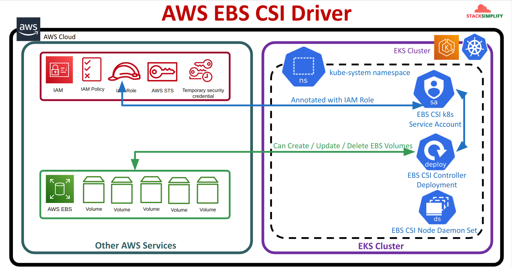
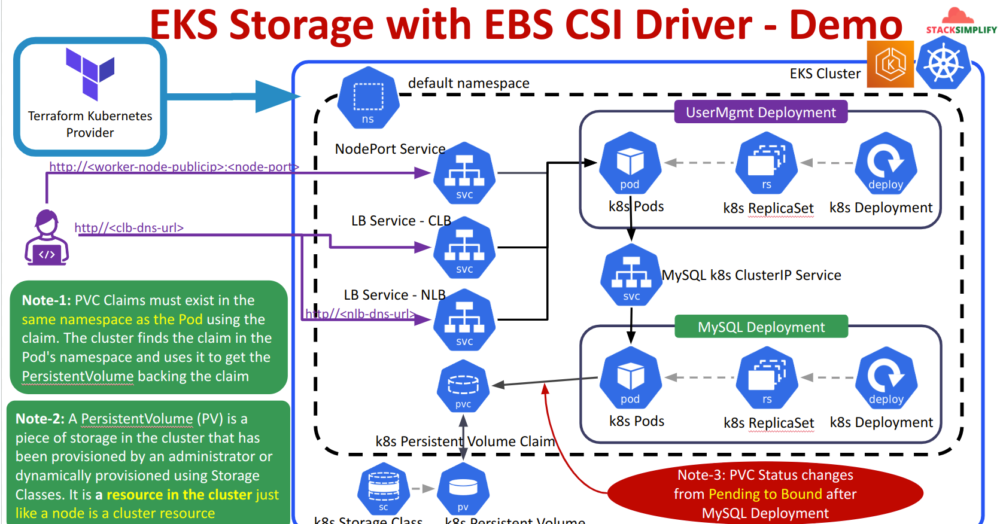
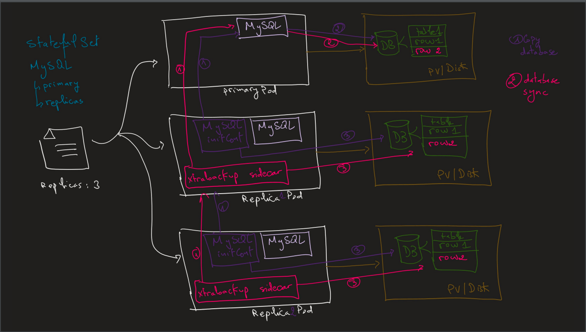
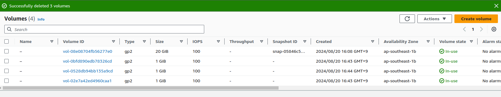

# Terraform EKS - EBS CSI

## I. AWS EBS CSI Driver


## II. EKS Storage with EBS CSI Driver - Demo



# Mysql Statefulset structure




## I. Configure Explanation

### 1. Init container: `init-mysql`
```
- Copies configuration from the Kubernetes-config-map to storage.
```

### 2. Init container: `clone-mysql`
```
- Clones the MySQL database from mysql-(index-1) (Exclude mysql-0).
```

### 3. Container: `mysql`
```
- Main container running MySQL.
```

### 4. container: `xtrabackup` running as sidecar container
```
xtrabackup responsible for:

# 1. primary pod (mysql-0)

- xtrabackup extract database from mysql-0 => save data to local

# 2. replica pod (mysql-1...n)
- extract data from database of mysql-(index-1) => save data to local
- compare diff and sync data with their database
```

### 5. Notes:
```
- The primary pod handles both reading and writing operations.

=> To reduce the workload on mysql-0 (the primary database), we clone data from mysql-(index-1) instead of mysql-0.

=> "The purpose is to reduce the workload of mysql-0 (primary database).

=> I want the standby servers to be utilized as much as possible
```

## II. Testing Command:

### 0. Update `kube-config`
```powershell
aws eks --region ap-southeast-1 update-kubeconfig --name study-dev-eks-cluster
```

### 1. Apply manifest
```powershell
# command:
k apply -f .

# Result:
storageclass.storage.k8s.io/ebs-gp2-storage-class created
configmap/user-management-db-script created
configmap/mysql created
secret/mysql-secret created
service/mysql-headless-service created
service/mysql created
statefulset.apps/mysql created
```
### 2. Check kubernetes resources:
```powershell
# command:
k get sts,pod,svc,pv,pvc

# Result:
AME                     READY   AGE
statefulset.apps/mysql   3/3     113s

NAME          READY   STATUS    RESTARTS      AGE
pod/mysql-0   2/2     Running   1 (69s ago)   113s
pod/mysql-1   2/2     Running   0             63s
pod/mysql-2   2/2     Running   0             41s

NAME                             TYPE        CLUSTER-IP     EXTERNAL-IP   PORT(S)    AGE
service/kubernetes               ClusterIP   172.20.0.1     <none>        443/TCP    53m
service/mysql                    ClusterIP   172.20.7.213   <none>        3306/TCP   113s
service/mysql-headless-service   ClusterIP   None           <none>        3306/TCP   114s

NAME                                                        CAPACITY   ACCESS MODES   RECLAIM POLICY   STATUS   CLAIM                  STORAGECLASS            VOLUMEATTRIBUTESCLASS   REASON   AGE
persistentvolume/pvc-6467287e-2702-4dc2-a208-8b2e322a1f1e   1Gi        RWO            Delete           Bound    default/data-mysql-0   ebs-gp2-storage-class   <unset>                          111s
persistentvolume/pvc-f983e533-7080-4e43-8e5a-a72366be6de1   1Gi        RWO            Delete           Bound    default/data-mysql-1   ebs-gp2-storage-class   <unset>                          60s
persistentvolume/pvc-fbccf929-54fc-4af9-a3ed-d3ff10bb2281   1Gi        RWO            Delete           Bound    default/data-mysql-2   ebs-gp2-storage-class   <unset>                          39s

NAME                                 STATUS   VOLUME                                     CAPACITY   ACCESS MODES   STORAGECLASS            VOLUMEATTRIBUTESCLASS   AGE
persistentvolumeclaim/data-mysql-0   Bound    pvc-6467287e-2702-4dc2-a208-8b2e322a1f1e   1Gi        RWO            ebs-gp2-storage-class   <unset>                 113s
persistentvolumeclaim/data-mysql-1   Bound    pvc-f983e533-7080-4e43-8e5a-a72366be6de1   1Gi        RWO            ebs-gp2-storage-class   <unset>                 63s
persistentvolumeclaim/data-mysql-2   Bound    pvc-fbccf929-54fc-4af9-a3ed-d3ff10bb2281   1Gi        RWO            ebs-gp2-storage-class   <unset>                 41s
```

### 3. check AWS EBS:



### 4. Insert data into the `mysql-0` (primary mysql) database

You can send test queries to the primary MySQL server (hostname mysql-0.mysql) by running a temporary container with the mysql:5.7 image and running the mysql client binary.

```powershell

# command:
kubectl run mysql-client --image=mysql:5.7 -i --rm --restart=Never -- bash -c '
  mysql -h mysql-0.mysql -u root -pduongdx1 -e "
    CREATE DATABASE test;
    USE test;
    CREATE TABLE messages (message VARCHAR(250));
    INSERT INTO messages VALUES (\"hello\");
  "'

# pod "mysql-client" deleted
```

**Cloning existing data**

```
Watch what will happen now.


when a new Pod joins the set as a replica, it must assume the primary MySQL server might already have data on it.
The second init container, named clone-mysql, performs a clone operation on a replica Pod the first time 
it starts up on an empty PersistentVolume. That means it copies all existing data from another running Pod, 
so its local state is consistent enough to begin replicating from the primary server.
MySQL itself does not provide a mechanism to do this, 
so the example uses a popular open-source tool called `Percona XtraBackup`. 
During the clone, the source MySQL server might suffer reduced performance. 
To minimize impact on the primary MySQL server, the script instructs each Pod to clone from the Pod whose ordinal index is one lower.
This works because the StatefulSet controller always ensures Pod N is Ready before starting Pod N+1.
```

**Starting replication**
```
After the init containers complete successfully, the regular containers run. 
The MySQL Pods consist of a mysql container that runs the actual mysqld server, 
and an `xtrabackup` container that acts as a sidecar.
The `xtrabackup` sidecar looks at the cloned data files and determines if it's necessary to initialize MySQL replication on the replica. 
If so, it waits for mysqld to be ready and then executes commands with replication parameters extracted from the `XtraBackup` clone files.
Replicas look for the primary server at its stable DNS name (mysql-0.mysql), 
they automatically find the primary server even if it gets a new Pod IP due to being rescheduled.
```

### 5.  Query database using the exposed service for read-only 

```powershell
# command:
kubectl run mysql-client --image=mysql:5.7 -i -t --rm --restart=Never -- bash -c 'mysql -h mysql.default.svc.cluster.local -u root -pduongdx1 -e "
    SELECT * FROM test.messages
"'

# -h mysql: name of mysql service
# +---------+
# | message |
# +---------+
# | hello   |
# +---------+
# pod "mysql-client" deleted
```

To demonstrate that the mysql-read Service distributes connections across servers, you can run SELECT @@server_id in a loop:

```powershell

# command:
kubectl run mysql-client --image=mysql:5.7 -i -t --rm --restart=Never -- bash -c "
  while sleep 1; do mysql -h mysql.default.svc.cluster.local -u root -pduongdx1 -e 'SELECT @@server_id,NOW()'; done"
  
#   If you don't see a command prompt, try pressing enter.
# #   +-------------+---------------------+
# #   | @@server_id | NOW()               |
# #   +-------------+---------------------+
# #   |         102 | 2022-12-21 14:34:09 |
# #   +-------------+---------------------+
# #   +-------------+---------------------+
# #   | @@server_id | NOW()               |
# #   +-------------+---------------------+
# #   |         100 | 2022-12-21 14:34:10 |
# #   +-------------+---------------------+
# #   +-------------+---------------------+
# #   | @@server_id | NOW()               |
# #   +-------------+---------------------+
# #   |         101 | 2022-12-21 14:34:11 |
# #   +-------------+---------------------+
```

### 6. Scaling the number of replicas

When you use MySQL replication, you can scale your read query capacity by adding replicas. 
For a StatefulSet, you can achieve this with a single command:

```powershell

# command:
kubectl scale statefulset mysql --replicas=5

# statefulset.apps/mysql scaled

kubectl get pods -l app=mysql --watch
# NAME      READY   STATUS    RESTARTS   AGE
# mysql-0   2/2     Running   0          3h32m
# mysql-1   2/2     Running   0          3h31m
# mysql-2   2/2     Running   0          8m37s
# mysql-3   0/2     Pending   0          1s
# mysql-3   0/2     Pending   0          3s
# mysql-3   0/2     Init:0/2   0          3s
# mysql-3   0/2     Init:1/2   0          15s
# mysql-3   0/2     Init:1/2   0          16s
# mysql-3   0/2     PodInitializing   0          24s
# mysql-3   1/2     Running           0          25s
# mysql-3   2/2     Running           0          31s
# mysql-4   0/2     Pending           0          0s
# mysql-4   0/2     Pending           0          3s
# mysql-4   0/2     Init:0/2          0          3s
# mysql-4   0/2     Init:1/2          0          16s
# mysql-4   0/2     Init:1/2          0          17s
# mysql-4   0/2     PodInitializing   0          24s
# mysql-4   1/2     Running           0          25s
# mysql-4   2/2     Running           0          30s
```

### 7. Verify database is replicated into the new replicas

Verify that these new servers have the data you added before they existed:

```powershell
# command:
kubectl run mysql-client --image=mysql:5.7 -i -t --rm --restart=Never -- bash -c "
    mysql -h mysql-3.mysql.default.svc.cluster.local -u root -pduongdx1 -e 'SELECT * FROM test.messages'
"
# mysql: [Warning] Using a password on the command line interface can be insecure.
# +---------+
# | message |
# +---------+
# | hello   |
# +---------+
# pod "mysql-client" deleted
```

### 8. Scaling back down the StatefulSet
```powershell
# command:
kubectl scale statefulset mysql --replicas=3
```

Although scaling up creates new PersistentVolumeClaims automatically, scaling down does not automatically delete these PVCs.
This gives you the choice to keep those initialized PVCs around to make scaling back up quicker, or to extract data before deleting them.

```powershell
# command:
kubectl get pvc -l app=mysql

# result:
NAME           STATUS   VOLUME                                     CAPACITY   ACCESS MODES   STORAGECLASS            VOLUMEATTRIBUTESCLASS   AGE
data-mysql-0   Bound    pvc-6467287e-2702-4dc2-a208-8b2e322a1f1e   1Gi        RWO            ebs-gp2-storage-class   <unset>                 44m
data-mysql-1   Bound    pvc-f983e533-7080-4e43-8e5a-a72366be6de1   1Gi        RWO            ebs-gp2-storage-class   <unset>                 43m
data-mysql-2   Bound    pvc-fbccf929-54fc-4af9-a3ed-d3ff10bb2281   1Gi        RWO            ebs-gp2-storage-class   <unset>                 43m
data-mysql-3   Bound    pvc-59b1558d-4325-4ad8-b2a6-ac6d1af78f60   1Gi        RWO            ebs-gp2-storage-class   <unset>  
```


### 9. deleting the unneeded PVs

```powershell
# command:
kubectl delete pvc data-mysql-3

# command:
kubectl get pvc -l app=mysql

# result:
NAME           STATUS   VOLUME                                     CAPACITY   ACCESS MODES   STORAGECLASS            VOLUMEATTRIBUTESCLASS   AGE
data-mysql-0   Bound    pvc-6467287e-2702-4dc2-a208-8b2e322a1f1e   1Gi        RWO            ebs-gp2-storage-class   <unset>                 46m
data-mysql-1   Bound    pvc-f983e533-7080-4e43-8e5a-a72366be6de1   1Gi        RWO            ebs-gp2-storage-class   <unset>                 45m
data-mysql-2   Bound    pvc-fbccf929-54fc-4af9-a3ed-d3ff10bb2281   1Gi        RWO            ebs-gp2-storage-class   <unset>
```

# Scaling Storage Size and edit `mysql-statefulset` configuration

### step 0: check configuration in `statefulset`
```yaml
persistentVolumeClaimRetentionPolicy:
    whenScaled: Retain
    whenDeleted: Retain
```

### step 1: check data `after` resize
```powershell
# Connect to mysql-0 MySQL Database
k exec -it mysql-0 -- /bin/bash -c 'mysql -u $MYSQL_USER -p$MYSQL_PASSWORD -e "select * from webappdb.users"'

# Result:
# Defaulted container "mysql" out of: mysql, xtrabackup, init-script (init), init-mysql (init), clone-mysql (init)
# mysql: [Warning] Using a password on the command line interface can be insecure.
# +----+----------+--------------------+
# | id | name     | email              |
# +----+----------+--------------------+
# |  1 | duongdx  | duongdx@gmail.com  |
# |  2 | duongdx2 | duongdx2@gmail.com |
# +----+----------+--------------------+

# Connect to mysql-1 MySQL Database
k exec -it mysql-1 -- /bin/bash -c 'mysql -u $MYSQL_USER -p$MYSQL_PASSWORD -e "select * from webappdb.users"'

# Result:
# Defaulted container "mysql" out of: mysql, xtrabackup, init-script (init), init-mysql (init), clone-mysql (init)
# mysql: [Warning] Using a password on the command line interface can be insecure.
# +----+----------+--------------------+
# | id | name     | email              |
# +----+----------+--------------------+
# |  1 | duongdx  | duongdx@gmail.com  |
# |  2 | duongdx2 | duongdx2@gmail.com |
# +----+----------+--------------------+

# PVC after resize
k get pvc

# NAME                 STATUS   VOLUME                                     CAPACITY   ACCESS MODES   STORAGECLASS            VOLUMEATTRIBUTESCLASS   AGE
# mysql-data-mysql-0   Bound    pvc-f81f12c3-0ec5-40b6-82f6-5f592c7a24a1   2Gi        RWO            ebs-gp3-storage-class   <unset>                 9m
# mysql-data-mysql-1   Bound    pvc-f8dda0df-80e7-4f44-85f7-aceabb030a69   2Gi        RWO            ebs-gp3-storage-class   <unset>                 9m
```

### step 2: Scale `old PVC - persistentVolumeClaim`
```powershell
# get all pvc with label
k get pvc -l app=mysql

# result:
# NAME                 STATUS   VOLUME                                     CAPACITY   ACCESS MODES   STORAGECLASS            VOLUMEATTRIBUTESCLASS   AGE
# mysql-data-mysql-0   Bound    pvc-231c3bd9-866d-4fca-8bf2-d28c1674807c   2Gi        RWO            ebs-gp3-storage-class   <unset>                 3m41s
# mysql-data-mysql-1   Bound    pvc-f39e9f55-4e54-4e78-818a-b48096a9cf35   2Gi        RWO            ebs-gp3-storage-class   <unset>                 3m41s

# update storage size
kubectl patch pvc mysql-data-mysql-0 --patch '{"spec":{"resources":{"requests":{"storage":"3Gi"}}}}'

kubectl patch pvc mysql-data-mysql-1 --patch '{"spec":{"resources":{"requests":{"storage":"3Gi"}}}}'
```

### step 3: check data `before` resize
```powershell

# Connect to mysql-0 MySQL Database
k exec -it mysql-0 -- /bin/bash -c 'mysql -u $MYSQL_USER -p$MYSQL_PASSWORD -e "select * from webappdb.users"'

# Result:
# Defaulted container "mysql" out of: mysql, xtrabackup, init-script (init), init-mysql (init), clone-mysql (init)
# mysql: [Warning] Using a password on the command line interface can be insecure.
# +----+----------+--------------------+
# | id | name     | email              |
# +----+----------+--------------------+
# |  1 | duongdx  | duongdx@gmail.com  |
# |  2 | duongdx2 | duongdx2@gmail.com |
# +----+----------+--------------------+

# Connect to mysql-1 MySQL Database
k exec -it mysql-1 -- /bin/bash -c 'mysql -u $MYSQL_USER -p$MYSQL_PASSWORD -e "select * from webappdb.users"'

# Result:
# Defaulted container "mysql" out of: mysql, xtrabackup, init-script (init), init-mysql (init), clone-mysql (init)
# mysql: [Warning] Using a password on the command line interface can be insecure.
# +----+----------+--------------------+
# | id | name     | email              |
# +----+----------+--------------------+
# |  1 | duongdx  | duongdx@gmail.com  |
# |  2 | duongdx2 | duongdx2@gmail.com |
# +----+----------+--------------------+


# PVC before resize
k get pvc

# NAME                 STATUS   VOLUME                                     CAPACITY   ACCESS MODES   STORAGECLASS            VOLUMEATTRIBUTESCLASS   AGE
# mysql-data-mysql-0   Bound    pvc-f81f12c3-0ec5-40b6-82f6-5f592c7a24a1   2Gi        RWO            ebs-gp3-storage-class   <unset>                 13m
# mysql-data-mysql-1   Bound    pvc-f8dda0df-80e7-4f44-85f7-aceabb030a69   2Gi        RWO            ebs-gp3-storage-class   <unset>                 13m
```

### step 4: update `statefulset` for future pod
```powershell
# check available statefulset
k get statefulset

# NAME    READY   AGE
# mysql   2/2     71m

# get old config
k get statefulset mysql -o yaml > new_mysql_statefulset.yml

# get old statefulset manifest file and change storage size: new_mysql_statefulset.yml
file: new_mysql_statefulset.yml ➜➜➜➜➜➜➜➜➜➜➜➜➜ storage: 2Gi -> storage: 3Gi
```

### step 5: ➜➜➜➜➜➜➜➜➜➜➜➜➜DELETE←←←←←←←←←←←←←←←←←← `old statefulset configuration`
```powershell

# delete old statefulset
kubectl delete statefulset mysql --cascade=orphan

# ➜➜➜➜➜➜➜➜➜➜➜➜➜➜➜➜➜➜➜➜➜➜➜➜MAGIC HERE: it don't delete the pod←←←←←←←←←←←←←←←←←←←←←←←←←←←
➜   k get statefulset
# No resources found in default namespace.

➜  k get pod
# NAME                           READY   STATUS    RESTARTS   AGE
# flask-webapp-75986db95-9hl8k   1/1     Running   0          135m
# mysql-0                        2/2     Running   0          49m
# mysql-1                        2/2     Running   0          15m
```

### step 6: Update new apply
```powershell
# command:
k apply -f new_mysql_statefulset.yml

# result:
# statefulset.apps/mysql created

# command:
k get statefulset

# # result:
# NAME    READY   AGE
# mysql   2/2     5s

k describe statefulset mysql
# Name:               mysql
# Namespace:          default
# CreationTimestamp:  Sun, 25 Aug 2024 14:37:10 +0700
# Selector:           app=mysql,app.kubernetes.io/name=mysql
# Labels:             app=mysql
#                     app.kubernetes.io/name=mysql
# Annotations:        <none>
# Replicas:           2 desired | 2 total
# Update Strategy:    RollingUpdate
#   Partition:        1
# Pods Status:        2 Running / 0 Waiting / 0 Succeeded / 0 Failed
# Pod Template:
#   Labels:       app=mysql
#                 app.kubernetes.io/name=mysql
#   Annotations:  kubectl.kubernetes.io/restartedAt: 2024-08-25T14:19:00+07:00
#   Init Containers:
#    init-script:
#     Image:      busybox:1.35
#     Port:       <none>
#     Host Port:  <none>
#     Command:
#       sh
#       -c
#       cp /mnt/scripts/*.sh /mnt/writable-scripts/ && chmod +x /mnt/writable-scripts/*.sh
#     Environment:  <none>
#     Mounts:
#       /mnt/scripts from container-init-volume (rw)
#       /mnt/writable-scripts from writable-scripts (rw)
#    init-mysql:
#     Image:      mysql:5.7
#     Port:       <none>
#     Host Port:  <none>
#     Command:
#       bash
#       -c
#       /mnt/writable-scripts/init-mysql.sh
#     Environment:  <none>
#     Mounts:
#       /mnt/conf.d from conf (rw)
#       /mnt/config-map from config-map (rw)
#       /mnt/writable-scripts from writable-scripts (rw)
#    clone-mysql:
#     Image:      gcr.io/google-samples/xtrabackup:1.0
#     Port:       <none>
#     Host Port:  <none>
#     Command:
#       bash
#       -c
#       /mnt/writable-scripts/clone-mysql.sh
#     Environment:  <none>
#     Mounts:
#       /etc/mysql/conf.d from conf (rw)
#       /mnt/writable-scripts from writable-scripts (rw)
#       /var/lib/mysql from mysql-data (rw,path="mysql")
#   Containers:
#    mysql:
#     Image:      mysql:5.7
#     Port:       3306/TCP
#     Host Port:  0/TCP
#     Limits:
#       cpu:     500m
#       memory:  1Gi
#     Requests:
#       cpu:      250m
#       memory:   500Mi
#     Liveness:   exec [/bin/sh -c mysqladmin ping -u root -p${MYSQL_ROOT_PASSWORD}] delay=30s timeout=5s period=10s #success=1 #failure=3
#     Readiness:  exec [/bin/sh -c mysql -h 127.0.0.1 -u root -p${MYSQL_ROOT_PASSWORD} -e 'SELECT 1'] delay=5s timeout=1s period=2s #success=1 #failure=3
#     Environment Variables from:
#       mysql-secret  Secret  Optional: false
#     Environment:    <none>
#     Mounts:
#       /docker-entrypoint-initdb.d from user-management-db-volume (rw)
#       /etc/mysql/conf.d from conf (rw)
#       /var/lib/mysql from mysql-data (rw,path="mysql")
#    xtrabackup:
#     Image:      gcr.io/google-samples/xtrabackup:1.0
#     Port:       3307/TCP
#     Host Port:  0/TCP
#     Command:
#       bash
#       -c
#       /mnt/writable-scripts/xtrabackup.sh
#     Limits:
#       cpu:     100m
#       memory:  100Mi
#     Requests:
#       cpu:     100m
#       memory:  100Mi
#     Environment Variables from:
#       mysql-secret  Secret  Optional: false
#     Environment:    <none>
#     Mounts:
#       /docker-entrypoint-initdb.d from user-management-db-volume (rw)
#       /etc/mysql/conf.d from conf (rw)
#       /mnt/writable-scripts from writable-scripts (rw)
#       /var/lib/mysql from mysql-data (rw,path="mysql")
#   Volumes:
#    conf:
#     Type:       EmptyDir (a temporary directory that shares a pod's lifetime)
#     Medium:
#     SizeLimit:  <unset>
#    config-map:
#     Type:      ConfigMap (a volume populated by a ConfigMap)
#     Name:      mysql
#     Optional:  false
#    user-management-db-volume:
#     Type:      ConfigMap (a volume populated by a ConfigMap)
#     Name:      user-management-db-script
#     Optional:  false
#    container-init-volume:
#     Type:      ConfigMap (a volume populated by a ConfigMap)
#     Name:      container-init-config-map
#     Optional:  false
#    writable-scripts:
#     Type:       EmptyDir (a temporary directory that shares a pod's lifetime)
#     Medium:     
#     SizeLimit:  <unset>
# Volume Claims:
#   Name:          mysql-data
#   StorageClass:  ebs-gp3-storage-class
#   Labels:        <none>
#   Annotations:   <none>
#   Capacity:      3Gi
#   Access Modes:  [ReadWriteOnce]
# Events:          <none>

```

### step 7: check scale out `mysql-statefulset`:
```powershell

# Scaling-out command:
k scale --replicas=3 statefulset/mysql


# check data of new pod
k exec -it mysql-2 -- /bin/bash -c 'mysql -u $MYSQL_USER -p$MYSQL_PASSWORD -e "select * from webappdb.users"'

# Defaulted container "mysql" out of: mysql, xtrabackup, init-script (init), init-mysql (init), clone-mysql (init)
# mysql: [Warning] Using a password on the command line interface can be insecure.
# +----+-----------------+-----------------+
# | id | name            | email           |
# +----+-----------------+-----------------+
# |  1 | duong@gmail.com | duong@gmail.com |
# |  2 | 1               | duong@gmail.com |
# |  3 | 2               | duong@gmail.com |
# +----+-----------------+-----------------+

# check PVC
k get pvc

# mysql-data-mysql-0   Bound    pvc-231c3bd9-866d-4fca-8bf2-d28c1674807c   3Gi        RWO            ebs-gp3-storage-class   <unset>                 59m
# mysql-data-mysql-1   Bound    pvc-f39e9f55-4e54-4e78-818a-b48096a9cf35   3Gi        RWO            ebs-gp3-storage-class   <unset>                 59m
# mysql-data-mysql-2   Bound    pvc-a80d4021-088f-4e7e-86e0-c41cb6a6cb0f   3Gi        RWO            ebs-gp3-storage-class   <unset>                 12s

```
