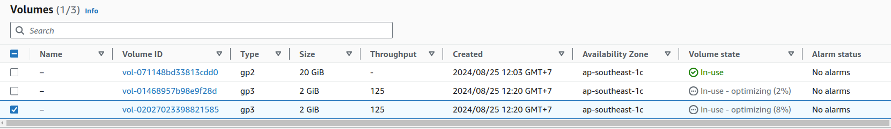
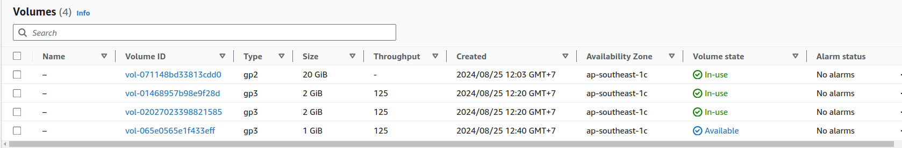

## Step-00: Introduction
- Implement the below two concepts on EKS Cluster usign EBS CSI Driver 
   - Resize EBS Volumes
   - Retain EBS Volumes 


## Pre-requisite: Verify EKS Cluster and EBS CSI Driver already Installed
### Project-01: 01-ekscluster-terraform-manifests
```powershell
# Change Directroy
cd eks/

# Terraform Initialize
terraform init

# List Terraform Resources (if already EKS Cluster created as part of previous section we can see those resources)
terraform state list

# Else Run below Terraform Commands
terraform validate
terraform plan
terraform apply -auto-approve

# Configure kubeconfig for kubectl
aws eks --region <region-code> update-kubeconfig --name <cluster_name>
aws eks --region ap-southeast-1 update-kubeconfig --name study-dev-eks-cluster

# Verify Kubernetes Worker Nodes using kubectl
kubectl get nodes
kubectl get nodes -o wide
```
### Project-02: 02-ebs-terraform-manifests
```powershell
# Change Directroy
cd terraform-kubernetes

# Terraform Initialize
terraform init

# List Terraform Resources (if already EBS CSI Driver created as part of previous section we can see those resources)
terraform state list

# Else Run below Terraform Commands
terraform validate
terraform plan
terraform apply -auto-approve

# Configure kubeconfig for kubectl
aws eks --region <region-code> update-kubeconfig --name <cluster_name>
aws eks --region ap-southeast-1 update-kubeconfig --name study-dev-eks-cluster

# Verify EBS CSI Controller and Node pods running in kube-system namespace
kubectl -n kube-system get pods
```   


## Step-01: Folder: 03-terraform-manifests-UMS-WebApp
- **File:** c4-01-storage-class.tf
- Add `allow_volume_expansion` and `reclaim_policy` settings
```powershell
# Resource: Kubernetes Storage Class
resource "kubernetes_storage_class_v1" "ebs_sc" {  
  metadata {
    name = "ebs-sc"
  }
  storage_provisioner = "ebs.csi.aws.com"
  volume_binding_mode = "WaitForFirstConsumer"
  allow_volume_expansion = "true"  
  reclaim_policy = "Retain" # Additional Reference: https://kubernetes.io/docs/tasks/administer-cluster/change-pv-reclaim-policy/#why-change-reclaim-policy-of-a-persistentvolume
}
```

## Step-02: Verify UMS Web App
```powershell
# Verify UserMgmt WebApp Pods
kubectl get pods

# List Services
kubectl get svc

# Access Usermgmt webapp
http://<CLB-DNS-URL>
http://<NLB-DNS-URL>
Username: admin101
Password: password101

# Create User admin102
Username: admin102
Password: password102
First Name: fname102
Last Name: lname102
email: email102@gmail.com
ssn: ssn102
```

## Step-03: c4-02-persistent-volume-claim.tf
- **Folder:** `17-EBS-Resizing-on-EKS/03-terraform-manifests-UMS-WebApp`
```powershell
# Change Storage from
        storage = "4Gi"

# Change Storage To
        storage = "6Gi"

# Because mysql is stateful set then we need edit each existing pvc manually
# Pod: mysql-0
k edit pvc mysql-data-mysql-0

# Pod: mysql-1
k edit pvc mysql-data-mysql-1

# edit statefulset
k edit sts mysql

```

## Step-04: Execute Terraform Commands
```powershell
# Verify before change: EBS Volume using Mgmt Console
Go to Services -> Elastic Block Store -> Volumes

# Verify before change: using kubectl
kubectl get pvc
kubectl get pv

# Terraform Plan
terraform plan

# Terraform Apply
terraform apply -auto-approve

# Verify after change: EBS Volume using Mgmt Console
Go to Services -> Elastic Block Store -> Volumes

# Verify after change: using kubectl
kubectl get pvc
kubectl get pv

# Access Usermgmt webapp and verify if any impact to DB
http://<CLB-DNS-URL>
http://<NLB-DNS-URL>
Username: admin101
Password: password101

# You can also try by connecting MySQL DB and verify
# Connect to mysql-0 MySQL Database
k exec -it mysql-0 -- /bin/bash -c 'mysql -u $MYSQL_USER -p$MYSQL_PASSWORD -e "select * from webappdb.users"'

# Result:
# Defaulted container "mysql" out of: mysql, xtrabackup, init-script (init), init-mysql (init), clone-mysql (init)
# mysql: [Warning] Using a password on the command line interface can be insecure.
# +----+----------+--------------------+
# | id | name     | email              |
# +----+----------+--------------------+
# |  1 | duongdx  | duongdx@gmail.com  |
# |  2 | duongdx2 | duongdx2@gmail.com |
# +----+----------+--------------------+

# Connect to mysql-1 MySQL Database
k exec -it mysql-1 -- /bin/bash -c 'mysql -u $MYSQL_USER -p$MYSQL_PASSWORD -e "select * from webappdb.users"'

# Result:
# Defaulted container "mysql" out of: mysql, xtrabackup, init-script (init), init-mysql (init), clone-mysql (init)
# mysql: [Warning] Using a password on the command line interface can be insecure.
# +----+----------+--------------------+
# | id | name     | email              |
# +----+----------+--------------------+
# |  1 | duongdx  | duongdx@gmail.com  |
# |  2 | duongdx2 | duongdx2@gmail.com |
# +----+----------+--------------------+

# after resize
k get pvc

# NAME                 STATUS   VOLUME                                     CAPACITY   ACCESS MODES   STORAGECLASS            VOLUMEATTRIBUTESCLASS   AGE
# mysql-data-mysql-0   Bound    pvc-f81f12c3-0ec5-40b6-82f6-5f592c7a24a1   1Gi        RWO            ebs-gp3-storage-class   <unset>                 9m
# mysql-data-mysql-1   Bound    pvc-f8dda0df-80e7-4f44-85f7-aceabb030a69   1Gi        RWO            ebs-gp3-storage-class   <unset>                 9m

# before resize
k get pvc

# NAME                 STATUS   VOLUME                                     CAPACITY   ACCESS MODES   STORAGECLASS            VOLUMEATTRIBUTESCLASS   AGE
# mysql-data-mysql-0   Bound    pvc-f81f12c3-0ec5-40b6-82f6-5f592c7a24a1   2Gi        RWO            ebs-gp3-storage-class   <unset>                 13m
# mysql-data-mysql-1   Bound    pvc-f8dda0df-80e7-4f44-85f7-aceabb030a69   2Gi        RWO            ebs-gp3-storage-class   <unset>                 13m

```


## Step-05: check scale `mysql-statefulset`:

## Step-05.1: check scale out `mysql-statefulset`:
```powershell

# Scaling-out command:
k scale --replicas=3 statefulset/mysql


# check data of new pod
k exec -it mysql-2 -- /bin/bash -c 'mysql -u $MYSQL_USER -p$MYSQL_PASSWORD -e "select * from webappdb.users"'

# Defaulted container "mysql" out of: mysql, xtrabackup, init-script (init), init-mysql (init), clone-mysql (init)
# mysql: [Warning] Using a password on the command line interface can be insecure.
# +----+-------------+-----------------------+
# | id | name        | email                 |
# +----+-------------+-----------------------+
# |  1 | duongdx     | duongdx@gmail.com     |
# |  2 | duongdx2    | duongdx2@gmail.com    |
# |  3 | duongdx3333 | duongdx3333@gmail.com |
# +----+-------------+-----------------------+
```

## Step-05.2: check scale out `mysql-statefulset`:
```powershell

# Scaling-in command:
k scale --replicas=2 statefulset/mysql


# check PVC and PV
k get pv

# NAME                                       CAPACITY   ACCESS MODES   RECLAIM POLICY   STATUS     CLAIM                        STORAGECLASS            VOLUMEATTRIBUTESCLASS   REASON   AGE
# pvc-ca870dbc-591d-4ef9-a2fd-21015e2c25cb   2Gi        RWO            Retain           Released   default/mysql-data-mysql-2   ebs-gp3-storage-class   <unset>                          3m46s
# pvc-f81f12c3-0ec5-40b6-82f6-5f592c7a24a1   2Gi        RWO            Retain           Bound      default/mysql-data-mysql-0   ebs-gp3-storage-class   <unset>                          23m
# pvc-f8dda0df-80e7-4f44-85f7-aceabb030a69   2Gi        RWO            Retain           Bound      default/mysql-data-mysql-1   ebs-gp3-storage-class   <unset>                          23m

k get pvc
# NAME                 STATUS   VOLUME                                     CAPACITY   ACCESS MODES   STORAGECLASS            VOLUMEATTRIBUTESCLASS   AGE
# mysql-data-mysql-0   Bound    pvc-f81f12c3-0ec5-40b6-82f6-5f592c7a24a1   2Gi        RWO            ebs-gp3-storage-class   <unset>                 23m
# mysql-data-mysql-1   Bound    pvc-f8dda0df-80e7-4f44-85f7-aceabb030a69   2Gi        RWO            ebs-gp3-storage-class   <unset>                 23m

```


## Step-06: CleanUp - 03-terraform-manifests-UMS-WebApp
```powershell
# Change Directory
cd 17-EBS-Resizing-on-EKS/03-terraform-manifests-UMS-WebApp

# Terraform Destroy
terraform destroy -auto-approve

# Delete Provider Plugin Files
rm -rf .terraform*
```

## Step-07: Verify Persistent Volume as we have put Retain setting
- Storage Class Setting in `c4-01-storage-class.tf` is `reclaim_policy = "Retain"`



```powershell
# Verify PVC
kubectl get pvc

# Verify PV
kubectl get pv
kubectl get pv -o yaml
Observation:
1. EBS Volume is not deleted when Storage Class and PVC were destroyed.
2. It will be the `Status: Released` mode as Persistent Volume

# Verify the same on AWS mgmt Console
Go to Services -> Elastic Block Store -> Volumes
Observation: 
1. Volume should be present here

# Delete PV
kubectl get pv

# NAME                                       CAPACITY   ACCESS MODES   RECLAIM POLICY   STATUS     CLAIM                        STORAGECLASS            VOLUMEATTRIBUTESCLASS   REASON   AGE
# pvc-ca870dbc-591d-4ef9-a2fd-21015e2c25cb   1Gi        RWO            Retain           Released   default/mysql-data-mysql-2   ebs-gp3-storage-class   <unset>                          3m46s
# pvc-f81f12c3-0ec5-40b6-82f6-5f592c7a24a1   2Gi        RWO            Retain           Bound      default/mysql-data-mysql-0   ebs-gp3-storage-class   <unset>                          23m
# pvc-f8dda0df-80e7-4f44-85f7-aceabb030a69   2Gi        RWO            Retain           Bound      default/mysql-data-mysql-1   ebs-gp3-storage-class   <unset>                          23m

kubectl delete pv <PV-NAME>
k delete pv pvc-ca870dbc-591d-4ef9-a2fd-21015e2c25cb

# Verify the same on AWS mgmt Console
Go to Services -> Elastic Block Store -> Volumes
Observation: 
1. Volume should be present here


# Manually delete the EBS Volume
Go to Services -> Elastic Block Store -> Volumes
Select and Delete Volume
``` 

## Step-08: CleanUp - 02-ebs-terraform-manifests
```powershell
# Change Directory
cd terraform-kubernets/

# List Terraform Resources
terraform state list

# Terraform Destroy
terraform apply -destroy -auto-approve

# Delete Provider Plugin Files
rm -rf .terraform* 
```

## Step-09: CleanUp - 01-ekscluster-terraform-manifests (Optional)
- Destroying EKS Cluster is optional in this step, if we are doing the next section related demo today. 
```powershell
# Change Directory
cd eks/

# List Terraform Resources
terraform state list

# Terraform Destroy
terraform apply -destroy -auto-approve

# Delete Provider Plugin Files
rm -rf .terraform* 
```