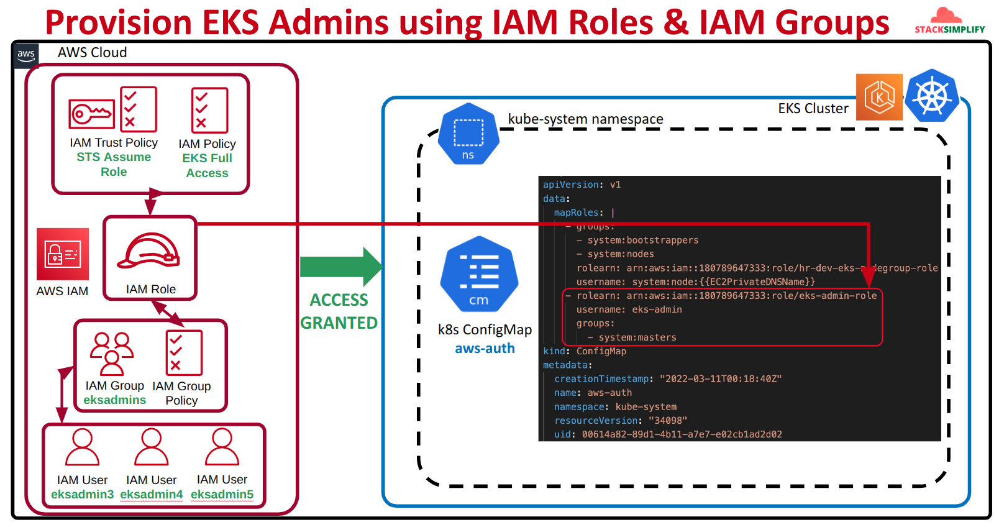
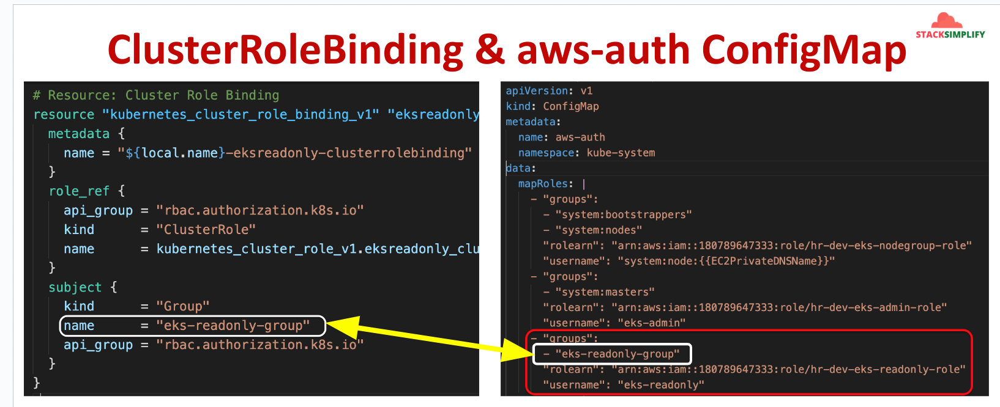

# IAM Admin User as ESK Admin

## I. Blue Print


### 1. Provision EKS Admins using IAM Roles & IAM Groups




### 2. Provision EKS ReadOnly using IAM Roles & IAM Groups

**step1: create `cluster-role`**


**step2: create `cluster-role-binding`**


**step3: create `configmap` for ready-only user**


## II. Demonstrate

### Step 1: Verify with which user we are creating EKS Cluster
- The user with which we create the EKS Cluster is called Cluster_Creator_User.

- This user information is not stored in AWS EKS Cluster aws-auth configmap but we should be very careful about remembering this user info.

- This user can be called as Master EKS Cluster user from AWS IAM and we should remember this user.

- If we face any issues with k8s aws-auth configmap and if we lost access to EKS Cluster we need the cluster_creator user to restore the stuff.

```powershell
# Get current user configured in AWS CLI
aws sts get-caller-identity

# Sample Output
aws sts get-caller-identity

# result
{
    "UserId": "AIDATQHCR4OMT2TN6TBLQ",
    "Account": <account-id>,
    "Arn": "arn:aws:iam::account-id:user/duong.dinhxuan"
}

# Make a note of  EKS Cluster Creator user
EKS_Cluster_Create_User: kalyandev (in my environment this is the user)
```

### Step-02: Pre-requisite: Create EKS Cluster
```powershell

# Terraform Initialize
terraform init

# List Terraform Resources (if already EKS Cluster created as part of previous section we can see those resources)
terraform state list

# Else Run below Terraform Commands
terraform validate
terraform plan
terraform apply -auto-approve

# Configure kubeconfig for kubectl
aws eks --region <region-code> update-kubeconfig --name <cluster_name>
aws eks --region ap-southeast-1 update-kubeconfig --name study-dev-eks-cluster

# Verify Kubernetes Worker Nodes using kubectl
kubectl get nodes
kubectl get nodes -o wide
```

### Step-03: Create AWS IAM User with Admin Access
```powershell
# Create IAM User
aws iam create-user --user-name eks-admin

# Attach AdministratorAccess Policy to User
aws iam attach-user-policy --policy-arn arn:aws:iam::aws:policy/AdministratorAccess --user-name eks-admin

# Set password for eks-admin user
aws iam create-login-profile --user-name eks-admin --password @EKSUser101 --no-password-reset-required

# Create Security Credentials for IAM User and make a note of them
aws iam create-access-key --user-name eks-admin

# Make a note of Access Key ID and Secret Access Key
User: eks-admin
{
    "AccessKey": {
        "UserName": "eks-admin",
        "AccessKeyId": "abcd12345",
        "Status": "Active",
        "SecretAccessKey": "12345678",
        "CreateDate": "2022-03-20T03:19:02+00:00"
    }
}

# verify with s3 ls command:
aws s3 ls --profile eks-admin

# result
# 2024-07-30 15:20:57 account-name-event-driven
# 2024-08-07 18:06:14 account-name-terraform-state
```

### Step-04: Create `eks-admin` user AWS CLI Profile
```powershell
# Clean-Up kubeconfig
cat $HOME/.kube/config
>$HOME/.kube/config
cat $HOME/.kube/config

# Configure kubeconfig for eks-admin AWS CLI profile
aws eks --region ap-southeast-1 update-kubeconfig --name study-dev-eks-cluster --profile eks-admin

# Verify kubeconfig file
# Observation: At the end of kubeconfig file we find that AWS_PROFILE it is using is "eks-admin" profile
cat $HOME/.kube/config | grep -A 2 -i "AWS_PROFILE"

# result:
      - name: AWS_PROFILE
        value: eks-admin


# Verify Kubernetes Nodes
kubectl get nodes
Observation: 
1. We should fail in accessing the EKS Cluster resources using kubectl

## Sample Output
kubectl get nodes

# error: You must be logged in to the server (Unauthorized)
```


### Step-05: Access EKS Cluster resources using AWS  Console
- Login to AWS Mgmt Console
  - Username: eks-admin
  - Password: @EKSUser101
- Go to Services -> Elastic Kubernetes Service -> Clusters -> Click on [Cluster_Name]
- Error / Warning

```
# Error / Warning
Your current user or role does not have access to Kubernetes objects on this EKS cluster
This may be due to the current user or role not having Kubernetes RBAC permissions to describe cluster resources or not having an entry in the cluster’s auth config map.
```

### Step-06: Review Kubernetes configmap aws-auth
```powershell
# Verify aws-auth config map before making changes
kubectl -n kube-system get configmap aws-auth -o yaml
Observation: Currently, eksadmin1 is configured as AWS CLI default profile, switch back to default profile.

# Configure kubeconfig for default AWS CLI profile (Switch back to EKS_Cluster_Create_User to perform these steps)
aws eks --region ap-southeast-1 update-kubeconfig --name study-dev-eks-cluster
[or]
aws eks --region ap-southeast-1 update-kubeconfig --name study-dev-eks-cluster --profile default

# Verify kubeconfig file
cat $HOME/.kube/config
      env:
      - name: AWS_PROFILE
        value: default
Observation: At the end of kubeconfig file we find that AWS_PROFILE it is using is "default" profile

# list up configmap
k get configmap -n kube-system

# NAME                                                   DATA   AGE
# amazon-vpc-cni                                         7      19m
# aws-auth                                               1      18m
# coredns                                                1      19m
# extension-apiserver-authentication                     6      20m
# kube-apiserver-legacy-service-account-token-tracking   1      20m
# kube-proxy                                             1      19m
# kube-proxy-config                                      1      19m
# kube-root-ca.crt                                       1      20m

# Verify aws-auth config map before making changes
kubectl -n kube-system get configmap aws-auth -o yaml
```

### step 7: update `aws-auth`

**original configuration:**
```yaml
apiVersion: v1
data:
  mapRoles: |
    - groups:
      - system:bootstrappers
      - system:nodes
      rolearn: arn:aws:iam::<account-id>:role/study-dev-eks-cluster-eks-node-group-role
      username: system:node:{{EC2PrivateDNSName}}
kind: ConfigMap
metadata:
  creationTimestamp: "2024-08-28T17:09:12Z"
  name: aws-auth
  namespace: kube-system
  resourceVersion: "758"
  uid: d509ee3d-6617-4eb2-90b1-1d79f48cfadb
```

**addition configuration to `configmap data`:**
```yaml
  mapUsers: |
    - userarn: arn:aws:iam::<account-id>:user/eks-admin
      username: eks-admin
      groups:
        - system:masters
```

**final result**:
```yaml
apiVersion: v1
data:
  mapRoles: |
    - groups:
      - system:bootstrappers
      - system:nodes
      rolearn: arn:aws:iam::<account-id>:role/study-dev-eks-cluster-eks-node-group-role
      username: system:node:{{EC2PrivateDNSName}}
  mapUsers: |
    - userarn: arn:aws:iam::<account-id>:user/eks-admin
      username: eks-admin
      groups:
        - system:masters
kind: ConfigMap
metadata:
  creationTimestamp: "2024-08-28T17:09:12Z"
  name: aws-auth
  namespace: kube-system
  resourceVersion: "758"
  uid: d509ee3d-6617-4eb2-90b1-1d79f48cfadb
```

### Step-08: Configure Kubernetes `configmap` aws-auth with `eks-admin` user

```powershell
# command:
aws eks --region ap-southeast-1 update-kubeconfig --name study-dev-eks-cluster --profile eks-admin

# try testing get node, pod, pvc ...
k get all -A

# results:
# NAMESPACE     NAME                          READY   STATUS    RESTARTS   AGE
# kube-system   pod/aws-node-ctpwh            2/2     Running   0          33m
# kube-system   pod/coredns-878d47785-dsllj   1/1     Running   0          35m
# kube-system   pod/coredns-878d47785-wd8jl   1/1     Running   0          35m
# kube-system   pod/kube-proxy-zntg2          1/1     Running   0          33m

# NAMESPACE     NAME                 TYPE        CLUSTER-IP    EXTERNAL-IP   PORT(S)                  AGE
# default       service/kubernetes   ClusterIP   172.20.0.1    <none>        443/TCP                  36m
# kube-system   service/kube-dns     ClusterIP   172.20.0.10   <none>        53/UDP,53/TCP,9153/TCP   35m

# NAMESPACE     NAME                        DESIRED   CURRENT   READY   UP-TO-DATE   AVAILABLE   NODE SELECTOR   AGE
# kube-system   daemonset.apps/aws-node     1         1         1       1            1           <none>          35m
# kube-system   daemonset.apps/kube-proxy   1         1         1       1            1           <none>          35m

# NAMESPACE     NAME                      READY   UP-TO-DATE   AVAILABLE   AGE
# kube-system   deployment.apps/coredns   2/2     2            2           35m

# NAMESPACE     NAME                                DESIRED   CURRENT   READY   AGE
# kube-system   replicaset.apps/coredns-878d47785   2         2         2       35m

```

### step9: Clear AWS IAM user
```powershell

# check attached  policy
aws iam list-attached-user-policies --user-name eks-admin

# de-attach AWS policy from the user:
aws iam attach-user-policy \
    --policy-arn arn:aws:iam::aws:policy/AdministratorAccess \
    --user-name eks-admin

# List Inline Policies
aws iam list-user-policies --user-name eks-admin

# delete Inline Policies
aws iam delete-user-policy --user-name <username> --policy-name <policy-name>

# list access-key pairs:
aws iam list-access-keys --user-name eks-admin

# delete access-key pairs
aws iam delete-access-key \
    --access-key-id ACCESS_KEY_ID \
    --user-name eks-admin

# delete AWS iam user:
aws iam delete-user --user-name eks-admin

```

### step-10: Clear AWS IAM user
```
terraform destroy -auto-approve
```